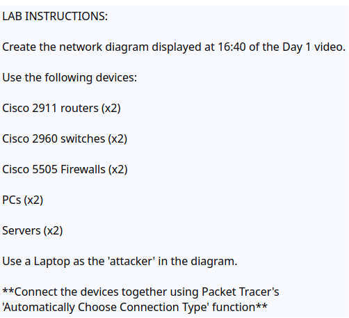
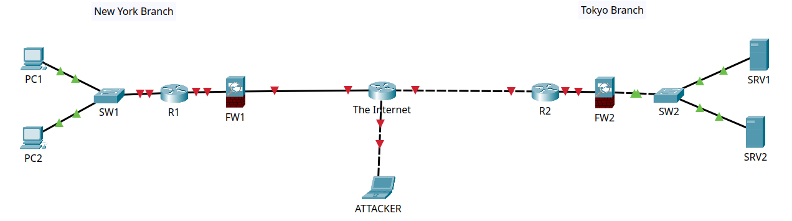

Day 1 - Network Devices

**Reviewed:**  

Local Area Networks (LANs) and their core devices, including clients, servers, switches, firewalls, routers, the Internet, and potential attackers.

**Lab:** 

Used Packet Tracer's automatic connection type function to connect two branch networks in different locations.

