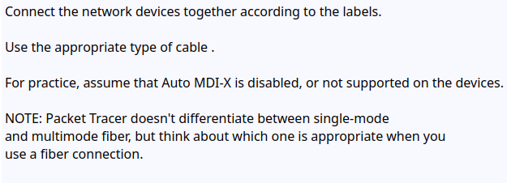
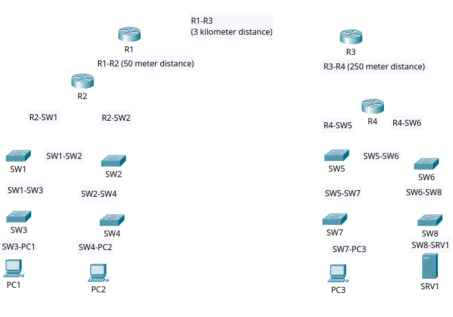
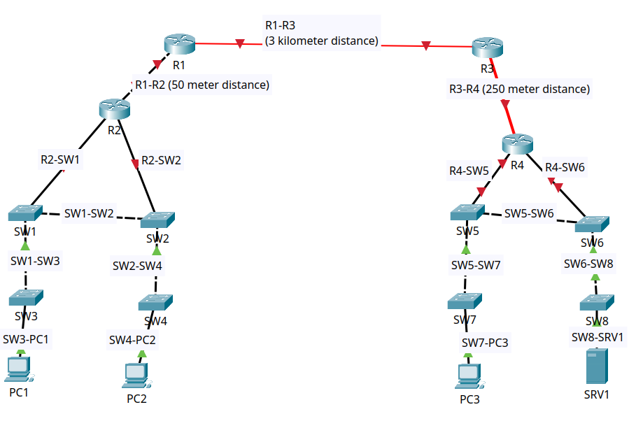

Day 2 - Interfaces and Cables

**Reviewed:**

Learned about Ethernet interfaces, cable categories, and their corresponding standards for various network devices.

**Lab:**

**Lab Solution:**

Since Auto MDI-X was not supported, straight-through cables were used to connect clients to switches and switches to routers. Cross-over cables were required for switch-switch and router-router connections. 

Because the distance between Router 3 and Router 4 exceeds 100 meters, a multi-mode fiber cable was used to properly link these devices. This choice provides a balance between cost efficiency and signal stability over medium distances. 

Finally, the connection between Router 1 and ROuter 3 spans 3 kilometers, necessitating the use of a single-mode fiber cable, which supports long-distance, high bandwidth communication with minimal signal loss.

