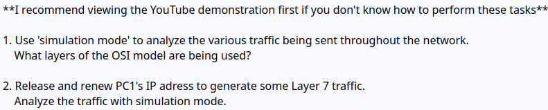
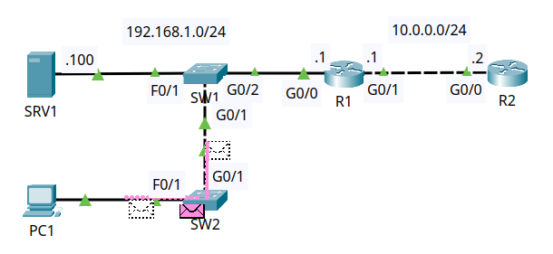
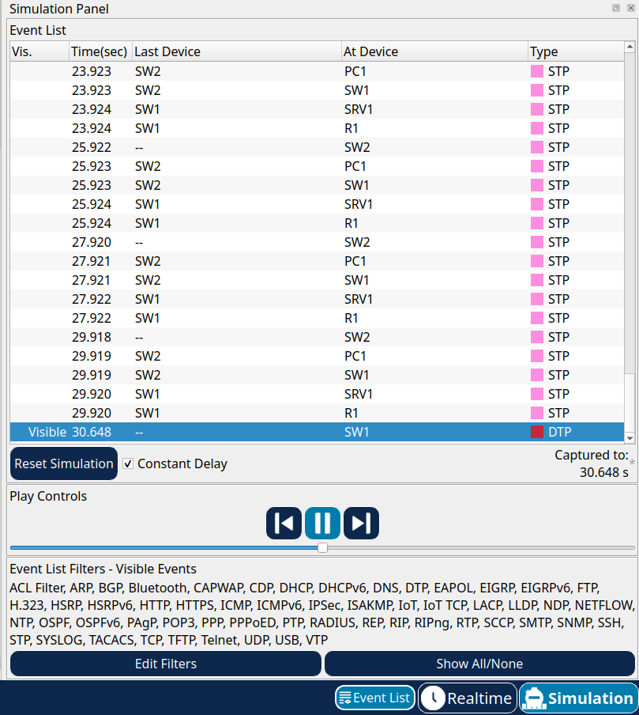
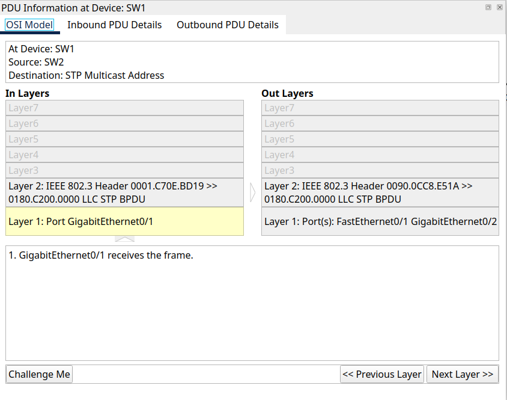
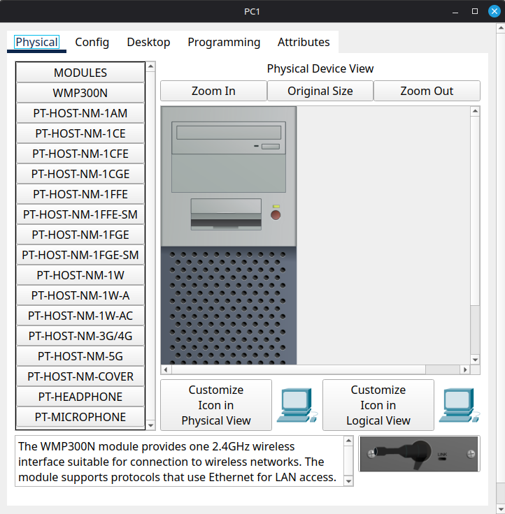
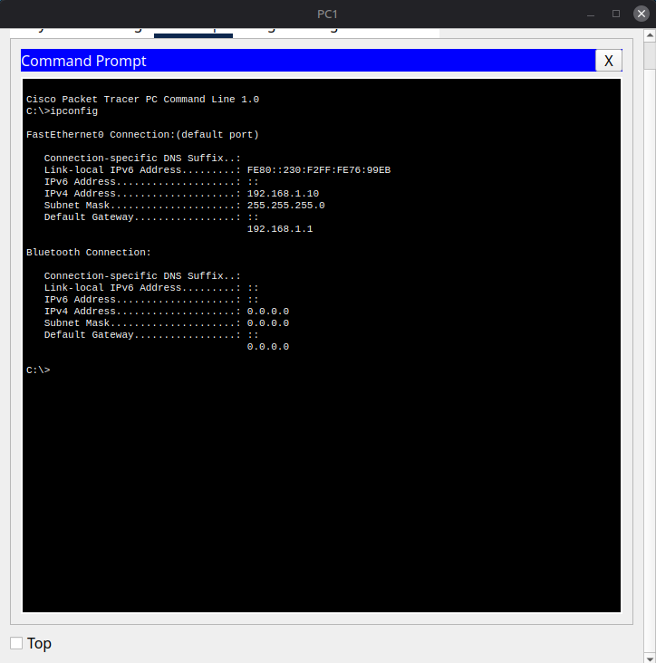
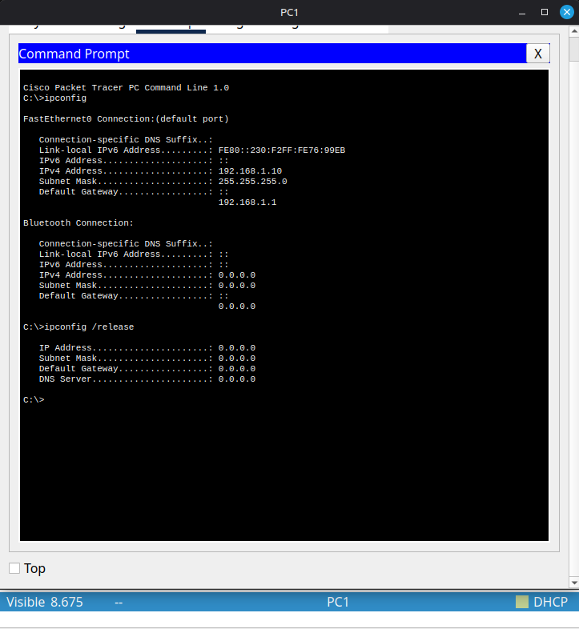
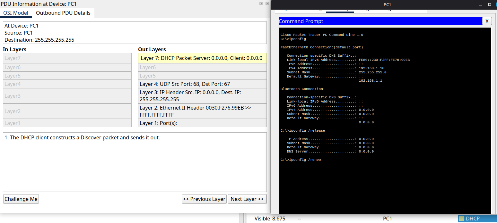

Day 3 - OSI Model & TCP/IP Suite

**Reviewed:**

Learned the 7 layers of the OSI Model and compared them to the TCP/IP Suite, understanding how each corresponds to modern networking protocls and operations.

    OSI MODEL               TCP/IP Suite
    7. Application      
    6. Presentation 
    5. Session              4. Application
    4. Transport            3. Transport
    3. Network              2. Internet
    2. Data Link
    1. Pyshical             1. Link

**Lab:**

**Lab Solution:**

Used Simulation Mode in Packet Tracer to analyze the various types of traffic sent throughout the network and identify which OSI layers were being utilized.

Released and renewed PC1's IP address to generate Layer 7(Application Layer) traffic and observed how packets moved through the OSI layers in simulation mode.

